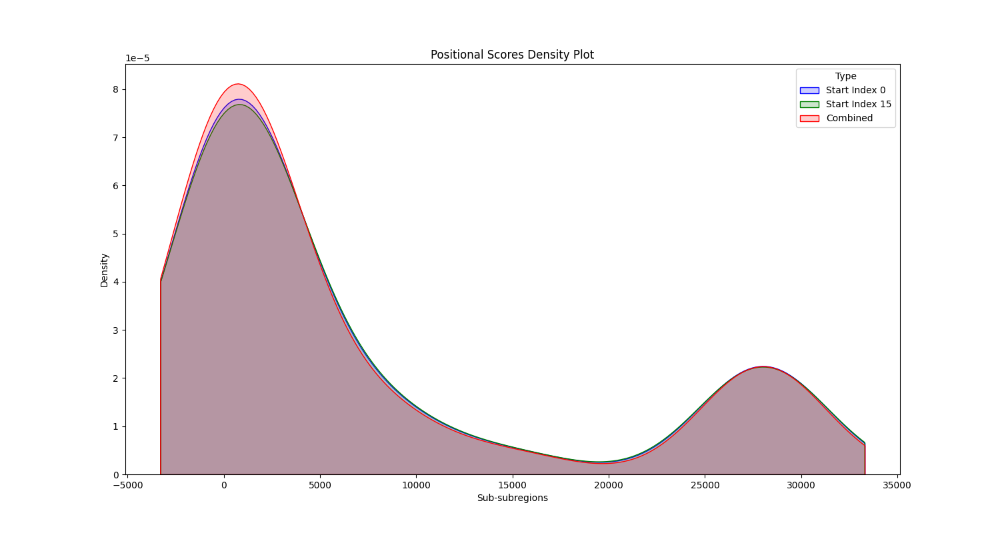
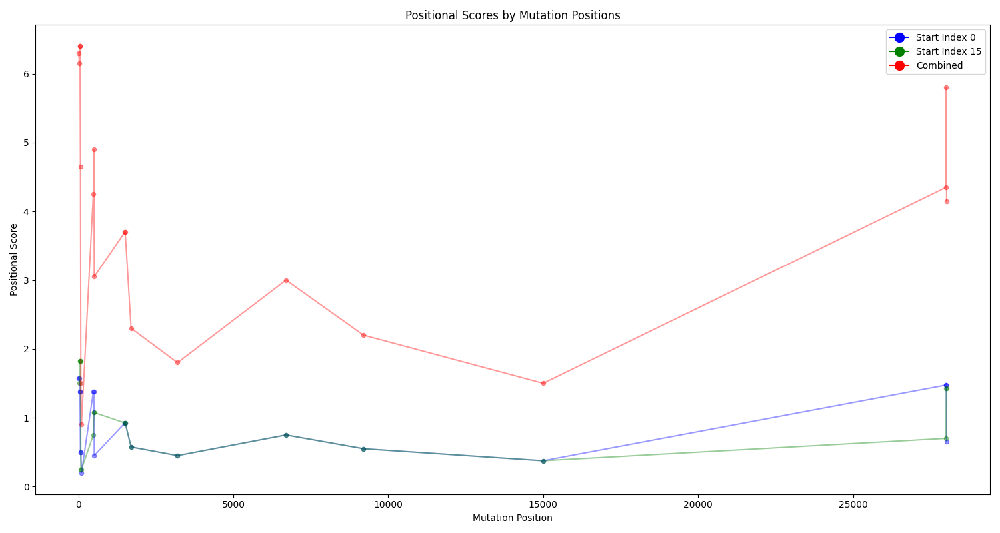
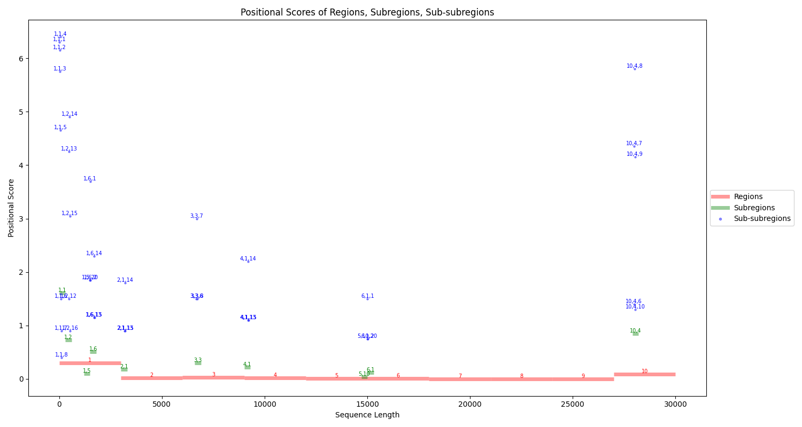
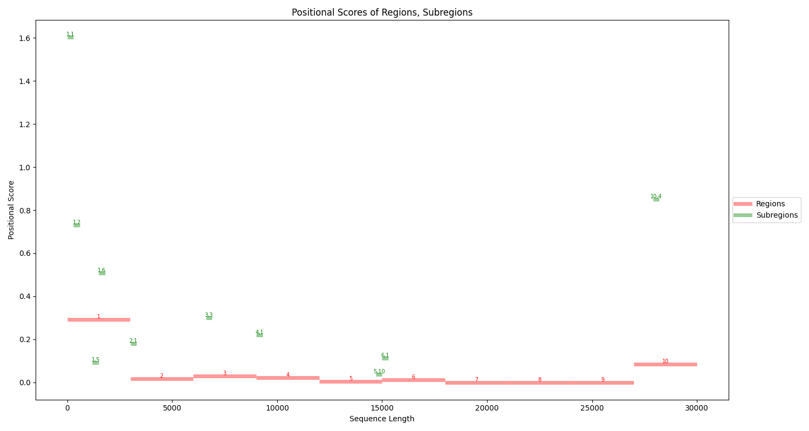
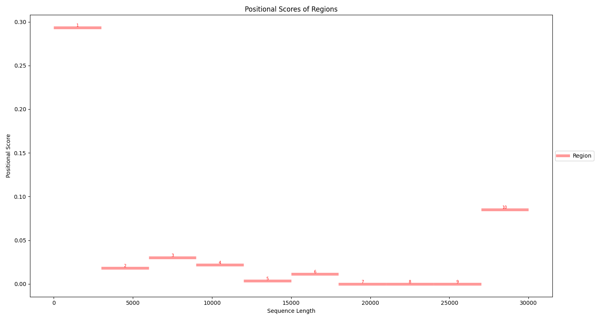
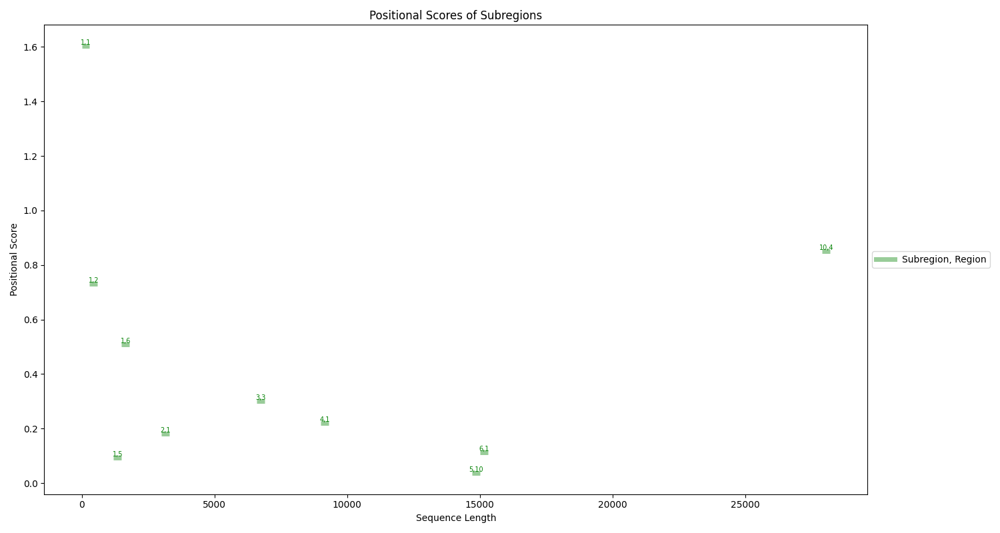
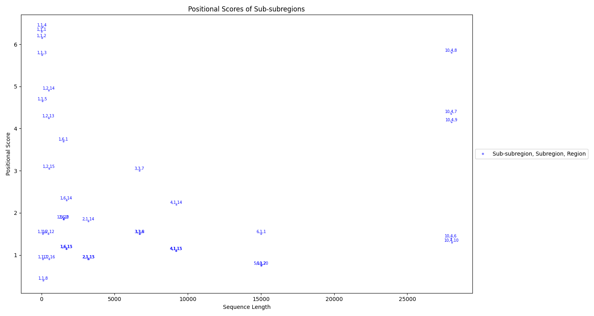

# MICA: Mutation Impact Clustering Algorithm

The MICA algorithm integrates partitioning and clustering methods to capture and analyze the positional impact of mutations (bases and regions) across DNA/RNA/protein sequences. It is designed to help researchers assess the impact of highly mutated bases and regions based on their positions and uncover the relationships between their positional impacts.

## Mutation Impact Clustering Algorithm (MICA) - Standard Version

This repository contains the standard version of the Mutation Impact Clustering Algorithm (MICA), which does not perform weight calculations.

For the weighted version of MICA with weight calculations, please visit the [MICA-Weighted](https://github.com/raeufroushangar/MICA-Weighted) repository.

## Project Description

The MICA repository serves as a toolkit for researchers to implement the MICA algorithm for analyzing mutation positional impacts.

## Directory Structure

- `src`: Contains source code files.
- `mutations_data.csv`: Sample CSV file with mutation data.

## mutations_data.csv

This file contains sample mutation data with the following columns:
- `mut_positions` (integer): Mutation positions in the sequence.
- `impact_score` (Positive float or integer): Impact score or Shannon entropy associated with mutations.

Replace the data in this file with your own mutation data before running the analysis.

## MICA_result

This directory contains the output results from the algorithm. The following files are generated:
- `positional_scores_0.csv`: Mapped mutations and calculated positional scores for sub-subregions partitioned starting at index 0.
- `positional_scores_15.csv`: Mapped mutations and calculated positional scores for sub-subregions partitioned starting at index 15.
- `combined_data.csv`: Combined data from both sets of partitioned sub-subregions.
- `region_details.csv`: Detailed information about regions, subregions, and sub-subregions.
- `region_scores.csv`: Range and score for each region.

## Plots

### Density, Scatter, and Bar Plots

1. **Density Plot of Positional Scores**
   - Description: This plot shows the density of positional scores of sub-subregions partitioned starting at index 0, index 15, and the combined data.
   - 

2. **Scatter Plot of Positional Scores by Mutation Positions**
   - Description: This plot shows the positional scores by mutation positions for sub-subregions partitioned starting at index 0, index 15, and the combined data.
   - 

3. **Bar Plot of Positional Scores Across Regions, Subregions, and Sub-subregions**
   - Description: This plot shows the positional scores of regions, subregions, and sub-subregions in the sequence.
   - 

4. **Scatter Plot of Positional Scores Across Regions and Subregions**
   - Description: This plot shows the positional scores of regions and subregions in the sequence.
   - 

5. **Scatter Plot of Positional Scores of Regions**
   - Description: This plot shows the positional scores of different regions in the sequence.
   - 

6. **Scatter Plot of Positional Scores of Subregions**
   - Description: This plot shows the positional scores of different subregions in the sequence.
   - 

7. **Scatter Plot of Positional Scores of Sub-subregions**
   - Description: This plot shows the positional scores of different sub-subregions in the sequence.
   - 

**Note:** The labels for plots 3, 4, 5, 6, and 7 are numbers representing regions, subregions, and sub-subregions. The format for these labels is "region, subregion" for subregions and "region, subregion, sub-subregion" for sub-subregions. Users can associate these numbers with their respective ranges across the sequence using the information provided in the `region_details.csv` file.

## System Requirements

- macOS 10.15 or higher / Windows 10 or higher / Linux
- Python 3.9 or higher
- pip3 24
- *May work with similar versions.

## Installation Instructions

1. Clone the repository:
   ```bash
   git clone https://github.com/raeufroushangar/MICA-Standard.git
   cd MICA-Standard

2. Create a virtual environment inside the MICA directory:
   ```bash
   python3 -m venv venv

3. Activate the virtual environment:

- On macOS and Linux:
   ```bash
   venv/bin/activate
- On Windows:
   ```bash
   .\venv\Scripts\activate

4. Install required packages:
   ```bash
   pip install -r requirements.txt

5. Run Analysis Script:
   ```bash
   python3 mica_main.py -f <mutation_file_path> -r <result_dir_path> -l <sequence_length>

   Replace: 
   - <mutation_file_path> with the path to your mutations_data.csv file
   - <result_dir> with the path of directory where you want to store the results
   - <sequence_length> with the length of your sequence
   
   For example:
   python3 -B mica_main.py -f /mutations_data.csv -r /MICA_result -l 30000

   To generate plots, include the --plot flag:
   python3 mica_main.py -f /mutations_data.csv -r /MICA_result -l 30000 --plot

6. To see the help message for the script:
   ```bash
   python3 mica_main.py -h
